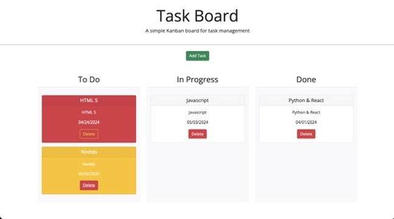

# task-board

[Deployed Link](https://imneeeks.github.io/task-board/)

## Description

This is a task board application that utilizes HTML/CSS/JS and third party API's.

## Features

- The home page displays project list seperated into three columns under three different status: To do, In progress, Done

- Task cards are color coded, indicating if task is close to deadline (yellow) or if task card is overdue (red)

- Task cards are added by clicking "Add Task" button. To define a new task, enter task title, description and due date into modal.

- The application will save any tasks entered into localStorage and will continue to display in column when refreshing the page.

- Task cards can be removed with functioning delete button.

